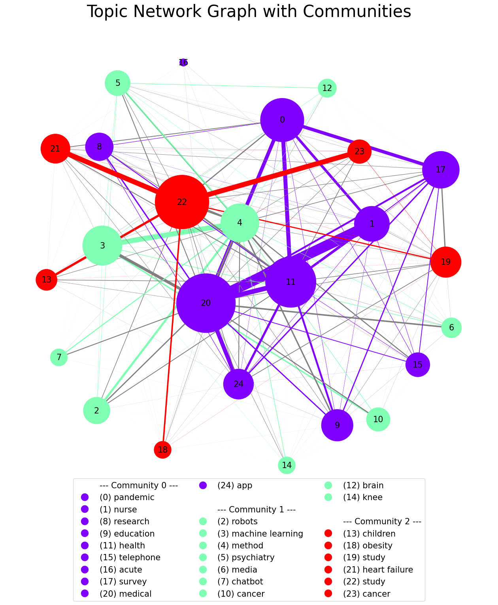

# LDA Topic Modelling

This repository contains a framework facilitating the use of **Latent Dirichlet Allocation** for **topic modelling**.
It contains **preprocessing**, **topic modelling**, **interpretation** and **visualization** methods. 
The *tomotopy-library* is leveraged for the LDA implementation.

## 1. What is topic modelling?
Topic modeling is an **unsupervised machine learning technique** used to identify hidden themes or topics within a large
collection of text documents by analyzing word patterns and co-occurrences. Common algorithms like Latent Dirichlet
Allocation (LDA) group words into topics, helping to summarize and organize unstructured text data for easier interpretation.

## 2. How does LDA work?
Latent Dirichlet Allocation (LDA) works by assuming that each document is a mixture of topics, and each topic is a
mixture of words, both represented as probability distributions. The algorithm reverse-engineers these distributions by
iteratively assigning words to topics based on their likelihood of belonging to a topic and refining the topic-document associations.

## 3. Repository Structure
- *data/*: example dataset and txt-files serving as input
- *literature/*: some papers relevant for the implementation
- *notebooks/*: a demo notebook demonstrating the workflow
- *output/*: example output plots
- *src/*: the source code of the framework

## 4. How to use
### 4.1. Required Modules
Please create a poetry environment based on the pyproject.toml with: *poetry init*
If you want to use an LLM for topic labelling, you need to further install torch with: *pip install torch*

### 4.2. Recommendations
Usage is demonstrated in the notebook, and it is advised to follow such procedure when implementing.
The utilized classes are **TextCorpusPreprocessor** from *src/pipeline/preprocessing.py* and **LDAEngine** from
*src/pipeline/topicmodelling.py*. The steps are as follows:

1. **preprocess** the text corpus: includes punctuation removal, lemmatization, stop word removal, abbreviation replacement, ...
2. **initialise an LDAEngine** and decide the number of topics based on e.g. coherence scores
3. **train the LDAModel**
4. **label the topics** with e.g. help of an LLM and human validation
5. **validate the results** by looking at the word-per-topic distributions and some example classifications
6. **interpret the results** through e.g. visualization

## 5. Other Important Information
### 5.1. Authors and Acknowledgment
Paul Rüsing - pr@paulruesing.de - single and main contributor

### 5.2. License
The project is licensed under the MIT license. To view a copy of this license, see [LICENSE](https://github.com/paulruesing/lda-topicmodelling?tab=MIT-1-ov-file).
